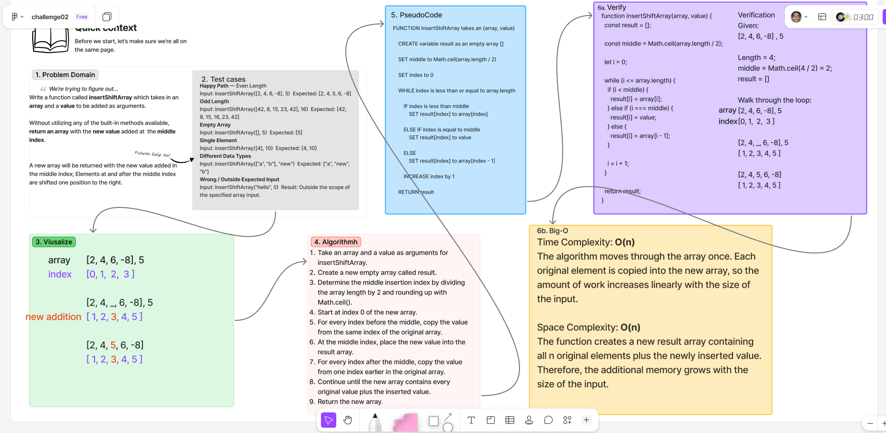

# ***insertShiftArr***

Write a function called **insertShiftArray** which takes in an *array* and a *value* as arguments and returns a *new* array with the *new value* added at the *middle index*.

## Whiteboard Process

  
[figma](https://www.figma.com/board/xwWOnbQgHeWeuhonZnCfZE/challenge02?node-id=0-1&t=zooAeI8561jgKBwc-1)

## Approach & Efficiency

### **Approach Explanation**

The approach first determines the middle insertion index using `Math.ceil(array.length / 2)`. This divides the length by two and rounds upward when necessary, **matching** the insertion locations shown in the provided examples.  
A new empty array called `result` is created.  
The function loops through the indexes of the new array.  
Values before the middle index are copied directly from the original array. At the middle index, the new value is inserted. After the middle index, each remaining value is copied from one index earlier in the original array.  
This creates a new array containing all of the original elements with the new value inserted in the middle without using a built-in insertion method.

### **The Big-O**

**Time Complexity:** `O(n)`
The function processes each element of the input array once, so the amount of work grows linearly with the size of the array.  

**Space Complexity:** `O(n)`
A new array is created containing all of the original elements plus the inserted value, so the additional memory used grows with the size of the input array. 


## Solution

The function takes an array and a value as arguments and returns a new array with the provided value inserted at the middle index.

```js
insertShiftArray([2, 4, 6, -8], 5); 
``` 

Expected output: 
```js 
[2, 4, *5*, 6, -8]
```

The solution written during the whiteboard process: 

```js 
function insertShiftArray(array, value) { 
  const result = []; 
  const middle = Math.ceil(array.length / 2); 
  let i = 0; 
  
  while (i <= array.length) { 
    if (i < middle) { 
      result[i] = array[i]; 
    } else if (i === middle) {
       result[i] = value; 
    } else { 
      result[i] = array[i - 1]; 
    } 
    
    i = i + 1; 
  } 
  
  return result; }
```

- [x] Top-level README “Table of Contents” is updated
- [x] README for this challenge is complete
  - [x] Summary, Description, Approach & Efficiency, Solution
  - [x] Picture of whiteboard
  - [x] [Link to code](#solution)
- [x] Feature tasks for this challenge are completed
- [x] Unit tests written and passing
  - [x] “Happy Path” - Expected outcome
  - [x] Expected failure
  - [x] Edge Case (if applicable/obvious)

