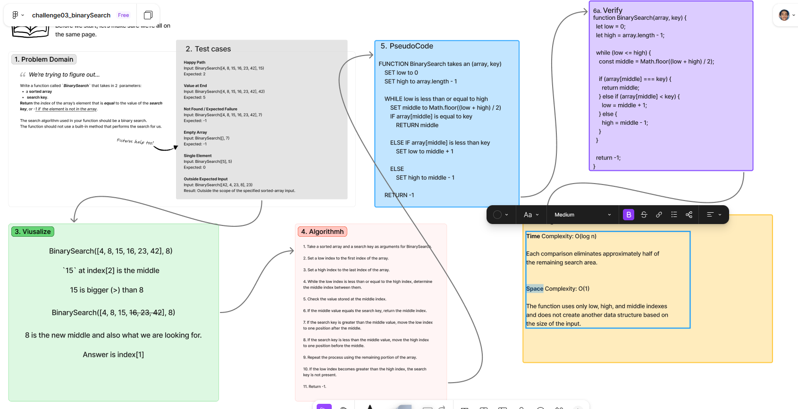

# ***BinarySearch***

Write a function called `BinarySearch` that takes a *sorted array* and a *search key* as arguments. Using a binary search algorithm, return the *index* of the element matching the search key or `-1` when the value is not present in the array.

## Whiteboard Process

  
[figma](https://www.figma.com/board/oAth5LuBVirazyAltvOAHE/challenge03_binarySearch?node-id=6842-159&t=kL5kmqfcDVywpo42-1)

## Approach & Efficiency

### **Approach Explanation**

The approach uses binary search to repeatedly reduce the portion of the sorted array that needs to be searched.

The function begins with a `low` index at the beginning of the array and a `high` index at the end. A middle index is calculated using `Math.floor((low + high) / 2)`.

If the value at the middle index matches the search key, the middle index is returned.

If the search key is greater than the middle value, the lower half of the remaining search area can be discarded by moving `low` to one position after the middle.

If the search key is less than the middle value, the upper half can be discarded by moving `high` to one position before the middle.

The process continues until the key is found or the remaining search area becomes empty. If the key is not found, the function returns `-1`.

### **The Big-O**

**Time Complexity:** `O(log n)`

Binary search eliminates approximately half of the remaining search area after each comparison. The number of operations therefore grows logarithmically as the size of the input array increases.

**Space Complexity:** `O(1)`

The iterative solution uses only a constant number of variables such as `low`, `high`, and `middle`. It does not create an additional data structure whose size grows with the input array.

## Solution

```js
function BinarySearch(array, key) {
  let low = 0;
  let high = array.length - 1;

  while (low <= high) {
    const middle = Math.floor((low + high) / 2);

    if (array[middle] === key) {
      return middle;
    } else if (array[middle] < key) {
      low = middle + 1;
    } else {
      high = middle - 1;
    }
  }

  return -1;
}
```

- [ ] Top-level README “Table of Contents” is updated
- [ ] README for this challenge is complete
  - [ ] Summary, Description, Approach & Efficiency, Solution
  - [ ] Picture of whiteboard
  - [ ] [Link to code](#solution)
- [ ] Feature tasks for this challenge are completed
- [ ] Unit tests written and passing
  - [ ] “Happy Path” - Expected outcome
  - [ ] Expected failure
  - [ ] Edge Case (if applicable/obvious)

<!----------------------------------------------------------------------------->
