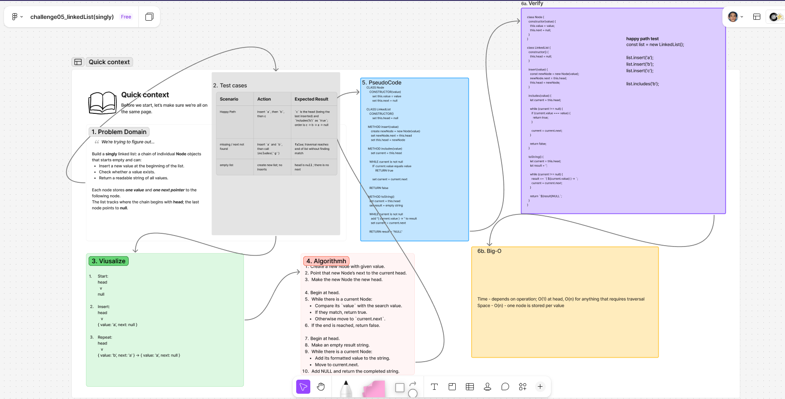

# ***Singly Linked List***

## Whiteboard Process

  
[figma](https://www.figma.com/board/LDskANtmodB3luDygqaDPt/challenge05_linkedList-singly-?node-id=0-1&t=1PFqMVNo5s5kugjU-1)

## Approach & Efficiency

### **Approach Explanation**

This challenge creates a singly linked list using two classes:

- `Node` stores a `value` and a `next` pointer.
- `LinkedList` stores a `head` pointer, which refers to the first Node in the list.

The `insert` method adds a new Node to the beginning of the list by pointing the new Node at the current `head`, then updating `head` to the new Node.

The `includes` and `toString` methods traverse the list one Node at a time. They begin at `head` and use a `current` variable to move through each Node by following its `next` pointer until `current` is `null`.

### **The Big-O**

| Method | Time Complexity | Space Complexity |
|---|---:|---:|
| `insert(value)` | O(1) | O(1) |
| `includes(value)` | O(n) | O(1) |
| `toString()` | O(n) | O(n) |

**Time Complexity:**

- `insert` is O(1) because it only creates one Node and updates the `head` reference.
- `includes` is O(n) because it may need to check every Node in the list.
- `toString` is O(n) because it visits every Node to create the formatted string.

**Space Complexity:**

- `insert` and `includes` use O(1) additional space.
- `toString` uses O(n) space because the returned string includes every value in the list.
- The linked list itself requires O(n) space because it stores one Node for each value.

## Solution

The following code creates a singly linked list and provides methods to insert values, search for a value, and return a formatted string representation of the list.

```js
class Node {
  constructor(value) {
    this.value = value;
    this.next = null;
  }
}

class LinkedList {
  constructor() {
    this.head = null;
  }

  insert(value) {
    const newNode = new Node(value);
    newNode.next = this.head;
    this.head = newNode;
  }

  includes(value) {
    let current = this.head;

    while (current !== null) {
      if (current.value === value) {
        return true;
      }

      current = current.next;
    }

    return false;
  }

  toString() {
    let current = this.head;
    let result = '';

    while (current !== null) {
      result += `{ ${current.value} } -> `;
      current = current.next;
    }

    return `${result}NULL`;
  }
}
```

```js
const list = new LinkedList();

list.insert('a');
list.insert('b');
list.insert('c');

list.includes('b');
// true

list.includes('z');
// false

list.toString();
// '{ c } -> { b } -> { a } -> NULL'
```

<!-- CHECKLIST: Whiteboard Process -->

- [ ] Top-level README “Table of Contents” is updated
- [ ] README for this challenge is complete
  - [ ] Summary, Description, Approach & Efficiency, Solution
  - [ ] Picture of whiteboard
  - [ ] [Link to code](#solution)
- [ ] Feature tasks for this challenge are completed
- [ ] Unit tests written and passing
  - [ ] “Happy Path” - Expected outcome
  - [ ] Expected failure
  - [ ] Edge Case (if applicable/obvious)

<!----------------------------------------------------------------------------->
