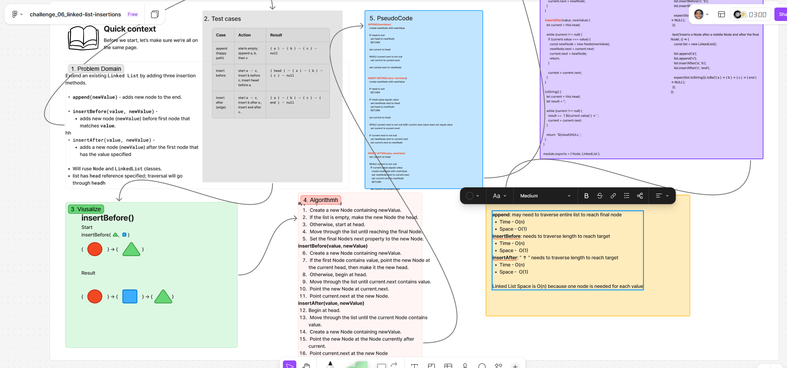

# ***Linked List Insertion***

## Whiteboard Process

  
(* Verify got cut off, but better viewed through live link below)  

### [figma](https://www.figma.com/board/cCx0vFkGVNbxeWFf83By3o/challenge_06_linked-list-insertions?node-id=6844-79&t=tAs9vHDK3UPv6SzP-1)

## Approach & Efficiency

### **Approach Explanation**

This challenge extends a singly linked list by adding `append`, `insertBefore`, and `insertAfter` methods.

The list uses a `head` property to refer to its first Node. Since it does not have a `tail` property, `append` traverses the list until it reaches the final Node before attaching the new Node.

Both `insertBefore` and `insertAfter` traverse from `head` to find the first Node containing the target value. Once found, the methods update the affected `next` references to place the new Node in the correct position.

### **The Big-O**

| Method | Time Complexity | Space Complexity |
|---|---:|---:|
| `append(newValue)`              | O(n) | O(1) |
| `insertBefore(value, newValue)` | O(n) | O(1) |
| `insertAfter(value, newValue)`  | O(n) | O(1) |

**Time Complexity:**

All three methods have **O(n)** worst-case time complexity because they may need to traverse the entire linked list.

**Space Complexity:**

Each method uses **O(1)** additional space because it stores only one new Node and a small number of reference variables. 

The linked list itself requires **O(n)** space because it stores one Node per value.

## Solution

```js
class Node {
  constructor(value) {
    this.value = value;
    this.next = null;
  }
}

class LinkedList {
  constructor() {
    this.head = null;
  }

  append(newValue) {
    const newNode = new Node(newValue);

    if (this.head === null) {
      this.head = newNode;
      return;
    }

    let current = this.head;

    while (current.next !== null) {
      current = current.next;
    }

    current.next = newNode;
  }

  insertBefore(value, newValue) {
    const newNode = new Node(newValue);

    if (this.head === null) {
      return;
    }

    if (this.head.value === value) {
      newNode.next = this.head;
      this.head = newNode;
      return;
    }

    let current = this.head;

    while (current.next !== null && current.next.value !== value) {
      current = current.next;
    }

    if (current.next !== null) {
      newNode.next = current.next;
      current.next = newNode;
    }
  }

  insertAfter(value, newValue) {
    let current = this.head;

    while (current !== null) {
      if (current.value === value) {
        const newNode = new Node(newValue);
        newNode.next = current.next;
        current.next = newNode;
        return;
      }

      current = current.next;
    }
  }
}
```

### Example / Test

```js
const list = new LinkedList();

list.append('a');
list.append('c');

list.insertBefore('c', 'b');
list.insertAfter('c', 'end');

list.toString();
// '{ a } -> { b } -> { c } -> { end } -> NULL'
```

<!-- CHECKLIST: Whiteboard Process -->

- [ ] Top-level README “Table of Contents” is updated
- [ ] README for this challenge is complete
  - [ ] Summary, Description, Approach & Efficiency, Solution
  - [ ] Picture of whiteboard
  - [ ] [Link to code](#solution)
- [ ] Feature tasks for this challenge are completed
- [ ] Unit tests written and passing
  - [ ] “Happy Path” - Expected outcome
  - [ ] Expected failure
  - [ ] Edge Case (if applicable/obvious)

<!----------------------------------------------------------------------------->
