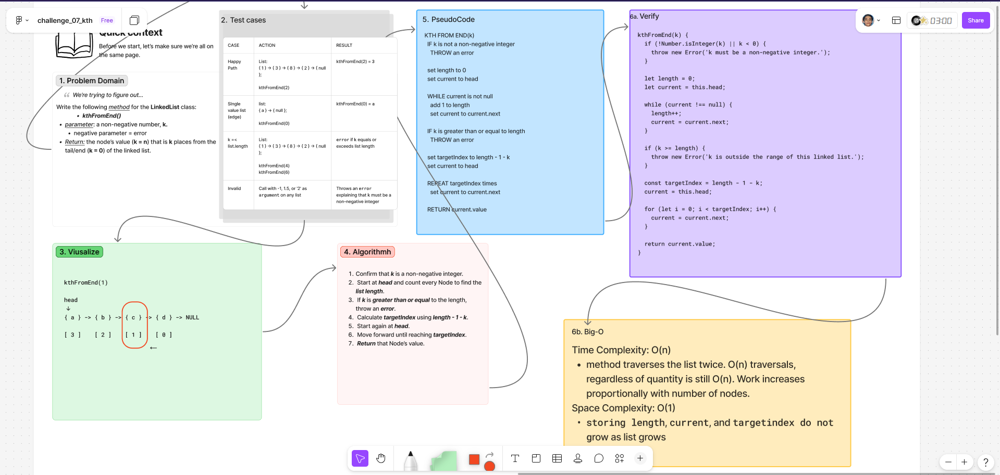

# ***Linked List Kth***

## Whiteboard Process

  

### [figma](https://www.figma.com/board/Xi3m2JbbCpWfDun5UO1YgQ/challenge_07_kth?node-id=0-1&t=beAFFzuDHArgmHYc-1)

## Approach & Efficiency

### **Approach Explanation**

This challenge adds a `kthFromEnd(k)` method to the existing singly linked list.

The method first traverses the linked list to count its Nodes. It then calculates the Node’s zero-based index from the head with:

```text
length - 1 - k
```

### **The Big-O**

**Time Complexity: O(n)**

The method traverses the linked list once to find its length and a second time to reach the calculated index. Both traversals are linear, which remains O(n).

**Space Complexity: O(1)**

The method uses a fixed number of variables and does not create another data structure that grows with the list.

## Solution

*Following method is added to existing `LinkedList` class*

```js
kthFromEnd(k) {
  if (!Number.isInteger(k) || k < 0) {
    throw new Error('k must be a non-negative integer.');
  }

  let length = 0;
  let current = this.head;

  while (current !== null) {
    length++;
    current = current.next;
  }

  if (k >= length) {
    throw new Error('k is outside the range of this linked list.');
  }

  const targetIndex = length - 1 - k;
  current = this.head;

  for (let i = 0; i < targetIndex; i++) {
    current = current.next;
  }

  return current.value;
}
```

### Example / Test

```js
const list = new LinkedList();

list.append(1);
list.append(3);
list.append(8);
list.append(2);

list.kthFromEnd(0);
// 2

list.kthFromEnd(2);
// 3
```

<!-- CHECKLIST: Whiteboard Process -->

- [ ] Top-level README “Table of Contents” is updated
- [ ] README for this challenge is complete
  - [ ] Summary, Description, Approach & Efficiency, Solution
  - [ ] Picture of whiteboard
  - [ ] [Link to code](#solution)
- [ ] Feature tasks for this challenge are completed
- [ ] Unit tests written and passing
  - [ ] “Happy Path” - Expected outcome
  - [ ] Expected failure
  - [ ] Edge Case (if applicable/obvious)

<!----------------------------------------------------------------------------->
