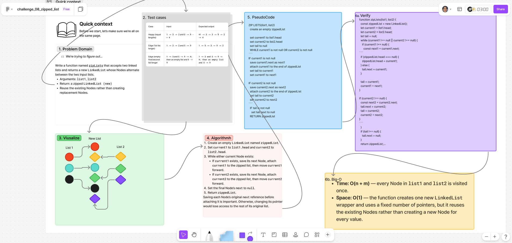

# ***zippedList***

## Whiteboard Process

  

### [figma](https://www.figma.com/board/itc0MlHo2OoJQilbyAopgA/challenge_08_zipped_list?node-id=0-1&t=pr5jwVLCCCZAjNJM-1)

## Approach & Efficiency

### **Approach Explanation**

The `zipLists` function uses pointers to move through both lists. It takes one Node from `list1`, then one Node from `list2`, and attaches each Node to a new zipped list.

Before attaching a Node, the function saves that Node’s original `next` reference. This prevents the remainder of the original list from being lost when the Node is connected to the zipped list.

If either list runs out of Nodes, the function continues adding Nodes from the remaining list.

### **The Big-O**

**Time Complexity:** O(n + m)

Every Node in both linked lists is visited once.

**Space Complexity:** O(1)

The function reuses the existing Nodes and uses only a fixed number of pointer variables. The returned `LinkedList` wrapper is also constant space.

## Solution

```js
function zipLists(list1, list2) {
  const zippedList = new LinkedList();

  let current1 = list1.head;
  let current2 = list2.head;
  let tail = null;

  while (current1 !== null || current2 !== null) {
    if (current1 !== null) {
      const next1 = current1.next;

      if (zippedList.head === null) {
        zippedList.head = current1;
      } else {
        tail.next = current1;
      }

      tail = current1;
      current1 = next1;
    }

    if (current2 !== null) {
      const next2 = current2.next;
      tail.next = current2;
      tail = current2;
      current2 = next2;
    }
  }

  if (tail !== null) {
    tail.next = null;
  }

  return zippedList;
}
```
### Example / Test

```bash
const list1 = new LinkedList();
list1.append(1);
list1.append(3);
list1.append(2);

const list2 = new LinkedList();
list2.append(5);
list2.append(9);

const zipped = zipLists(list1, list2);

zipped.toString();
// '{ 1 } -> { 5 } -> { 3 } -> { 9 } -> { 2 } -> NULL'
```

<!-- CHECKLIST: Whiteboard Process -->

- [ ] Top-level README “Table of Contents” is updated
- [ ] README for this challenge is complete
  - [ ] Summary, Description, Approach & Efficiency, Solution
  - [ ] Picture of whiteboard
  - [ ] [Link to code](#solution)
- [ ] Feature tasks for this challenge are completed
- [ ] Unit tests written and passing
  - [ ] “Happy Path” - Expected outcome
  - [ ] Expected failure
  - [ ] Edge Case (if applicable/obvious)

<!----------------------------------------------------------------------------->
